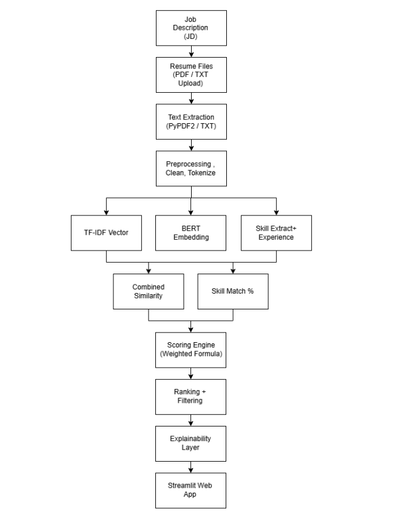

# 🤖 AI Resume Screening & Candidate Ranking System

An AI-powered application that ranks resumes against a job description using NLP, Machine Learning, and semantic similarity.

🌐 **Live Demo:** https://ai-resume-screening-nj.streamlit.app/

---

## ✨ Features

- 📄 Upload multiple resumes
- 💼 Paste a job description
- 🤖 Resume categorization using Machine Learning
- 🎯 Candidate ranking based on similarity, skills, and experience
- 📊 Interactive Streamlit dashboard

---

## 🛠 Tech Stack

**Machine Learning**
- Scikit-learn
- TF-IDF
- Linear SVM
- Sentence-BERT

**Libraries**
- Streamlit
- Pandas
- NumPy
- NLTK
- Plotly
- PyPDF2
- pdfplumber

---

## 🏗️ System Architecture

<p align="center">
  
</p>

---

## 📊 Model Performance

| Model | Accuracy |
|-------|---------:|
| **Linear SVM** | **88.24%** |
| Random Forest | 82.35% |
| Naive Bayes | 41.18% |

---

## 📂 Dataset

The training dataset is **not included** in this repository.

Download it from:

https://www.kaggle.com/datasets/serkanp/resume-screening/data

Place `Resume.csv` inside:

```
data/raw/
```

to retrain the model.

---

## 🚀 Run Locally

```bash
git clone https://github.com/nirvani-nj/ai-resume-screening.git
cd ai-resume-screening
pip install -r requirements.txt
streamlit run app/streamlit_app.py
```
